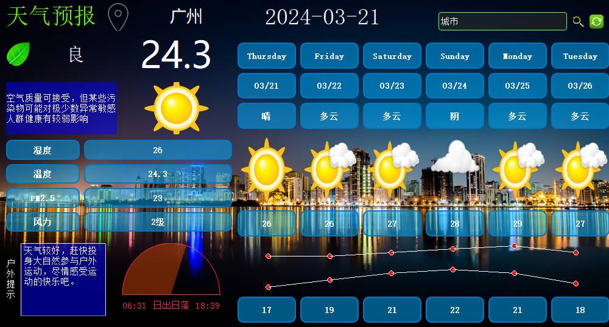
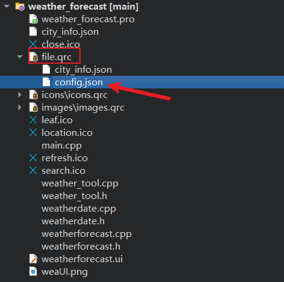

# weather_forecast 天气预报
## 基于C++使用Qt实现的天气预报项目

总代码量1000行左右，功能如下：

- 通过城市名查询近7日天气状况，温度变化直线图等
- 通过城市名查询当日天气概括，包括户外指示，空气质量，pm2.5，风速，日出日落等

具体应用展示如下



## 相关文件配置

今日天气概况调用阿里云api市场，[聚美天气预报](https://market.aliyun.com/products/57126001/cmapi014302.html?spm=5176.2020520132.0.0.5cd97218wDUD7k#sku=yuncode830200001)，该api可以免费调用100次，直接购买即可

近15日天气概况调用阿里云api市场，[极速天气预报](https://market.aliyun.com/products/57126001/cmapi014302.html?spm=5176.2020520132.101.4.4a0672187MATLT#sku=yuncode830200002)，该api可以免费调用100次，直接购买即可

购买完毕后，回到阿里云api控制台，将下图中红框部分的AppCode进行复制，两个AppCode应该都是一样的，复制哪一个都行。

接着在项目根目录创建一个config.json文件，填入如下内容
```
{
"Authorization" : "APPCODE 你的Appcode"
}
```
创建完毕后，在qtcreator中加入到file.qrc资源文件

最后直接构建运行即可


